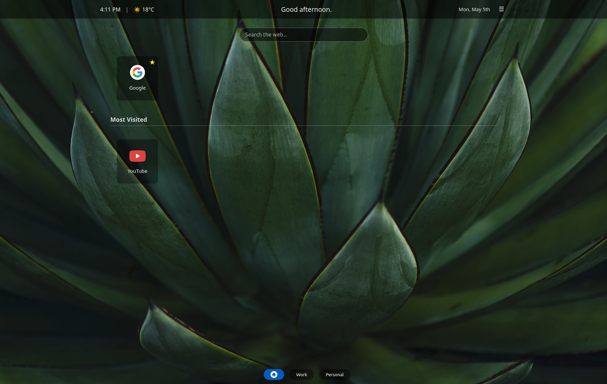
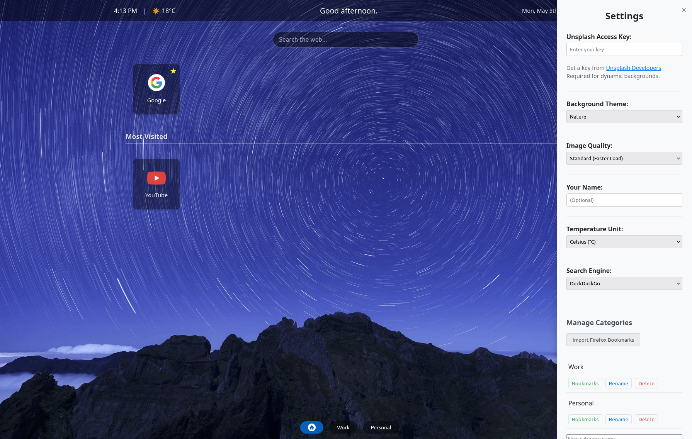
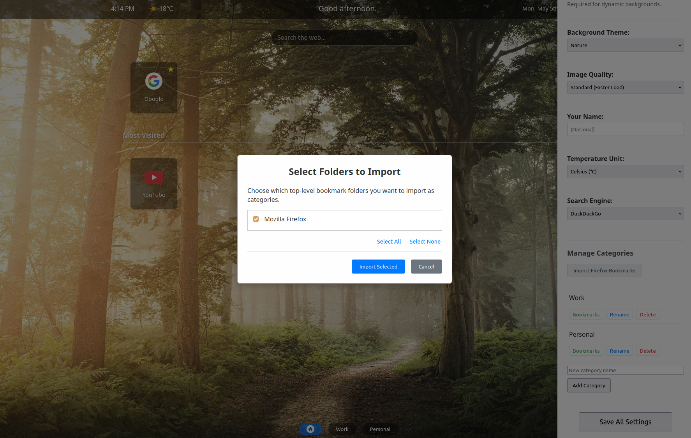

# Tabvana - Your Personalized New Tab

Tabvana transforms your new tab page into a dynamic and customizable dashboard, putting your bookmarks, favorite sites, and a touch of inspiration right where you need them.

## ✨ Features

*   **Icon-Based Bookmark Management:** Organize your bookmarks into customizable categories. View them as easy-to-recognize icons using website favicons.
*   **Favorites & Top Sites:** Access your most visited websites (`topSites`) and pin your favorite bookmarks for quick access on the main view.
*   **Collapsible Categories:** Keep your dashboard tidy by collapsing and expanding bookmark categories.
*   **Dynamic Unsplash Backgrounds:** Personalize your new tab with beautiful backgrounds fetched daily from Unsplash. Requires a free Unsplash API key. Choose your preferred theme (nature, tech, etc.) and quality.
*   **Time & Date Display:** Stay informed with the current time and date prominently displayed.
*   **Search Integration:** Quickly search the web using your preferred search engine directly from the new tab page.
*   **Settings Panel:** Customize Tabvana through an accessible settings panel (cog icon):
    *   Manage Unsplash settings (API Key, Theme, Quality).
    *   Set your preferred username for greetings.
    *   Choose temperature units (for future weather features).
    *   Select your default search engine.
    *   Add, remove, rename, and manage bookmarks within categories.
    *   Import bookmarks from existing Firefox folders.

## 🚀 Installation & Usage

1.  **Download/Clone:** Get the extension code (e.g., clone the repository).
2.  **Firefox Add-ons:** Open Firefox, navigate to `about:debugging#/runtime/this-firefox`.
3.  **Load Temporary Add-on:** Click "Load Temporary Add-on..." and select the `manifest.json` file from the project directory.
4.  **New Tab:** Open a new tab to see Tabvana in action!
5.  **Homepage (Optional):** You can also set your Firefox homepage to the extension's new tab page if desired.

## ⚙️ Configuration

*   Access the settings panel using the cog icon (⚙️) typically located in one of the corners.
*   To enable dynamic Unsplash backgrounds, you need to obtain a free API key (Access Key) from [Unsplash Developers](https://unsplash.com/developers) and enter it in the settings panel.

## 🔐 Permissions Explained

Tabvana requires the following permissions to function:

*   `bookmarks`: To read your bookmark tree (for import and display) and potentially modify bookmarks (if future editing features are added within the extension).
*   `storage`: To save your settings locally (like Unsplash API key, theme preferences, category states, username, search engine choice).
*   `topSites`: To display your most frequently visited websites on the initial view.
*   `tabs`: Used implicitly when opening bookmarks or search results in new tabs.

## 🔒 Privacy Policy

Your privacy is important. Here's how Tabvana handles your data:

*   **Data Collected & Stored:**
    *   **Settings:** User preferences such as your chosen Unsplash theme, quality setting, username (optional, for greeting), preferred temperature unit, and selected search engine are stored.
    *   **Unsplash API Key:** If you provide an Unsplash API key for dynamic backgrounds, it is stored.
    *   **Bookmark Data:** Information about the categories you create and the bookmarks you add or import (titles, URLs, custom icons if set, favorite status) is stored.
*   **Purpose of Data Collection:** This data is collected solely to provide the features of the extension, such as personalizing the background, greeting you, remembering your layout preferences, managing your bookmarks within the extension, and enabling search.
*   **Data Usage & Storage:** All collected data (settings, API key, bookmark structure) is stored **locally** on your computer using the browser's standard `storage.local` API.
*   **Data Sharing:** Your data is **not shared** with any third parties. It remains on your local machine under your control. Network requests are made only to Unsplash (if API key is provided) to fetch background images and to Google's favicon service (or directly to website servers via `topSites`) to retrieve website icons.

## 📜 License

This project is licensed under the MIT License - see the [LICENSE](LICENSE) file for details.

*(This README is generated based on project analysis and may require updates as the project evolves.)* 